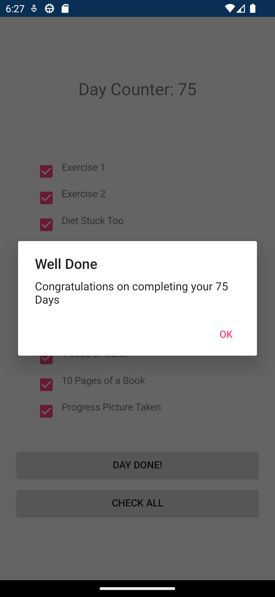

## Table of contents
* [General info](#general-info)
* [How to run / build](#how-to-run/build)
* [Technologies](#technologies)
* [Project Goals](#project-goals)
* [Screenshots](#screenshots)
* [Authors](#authors)

## General info
75 Hard fittness challange tracker for android devices

This is an app i have put together to help following the 75 Hard fittness program.

## How to run / build
As this appliccation has not been published, the reposetory will need to be cloned and the solution built onto a device using Visual Studio.

## Technologies
Project is created with:
* Xamarin
* C#

## Project Goals
This was an ealry project in my Xxamarin jorney, I used this project to learn how to utilise XAML checkboxes while creating myself an app to help track a fitness program.

## Screenshots

## Authors
Oliver Swindlehurst

